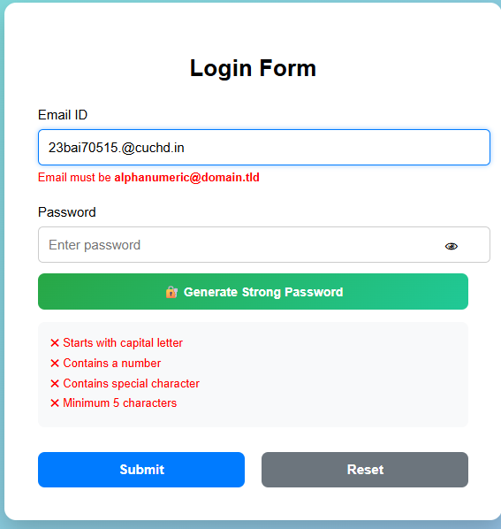
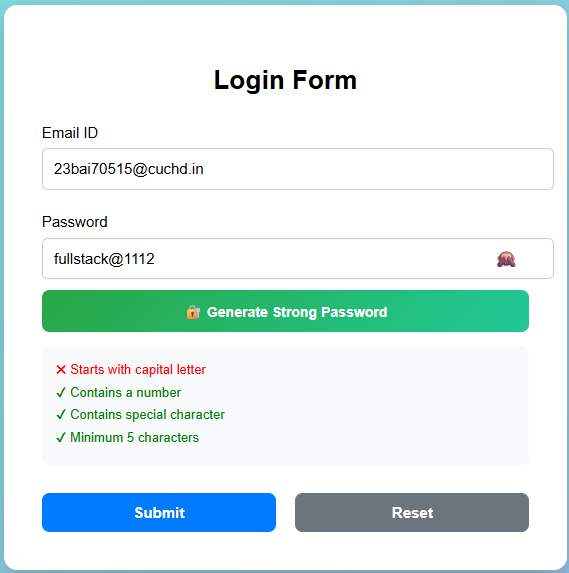
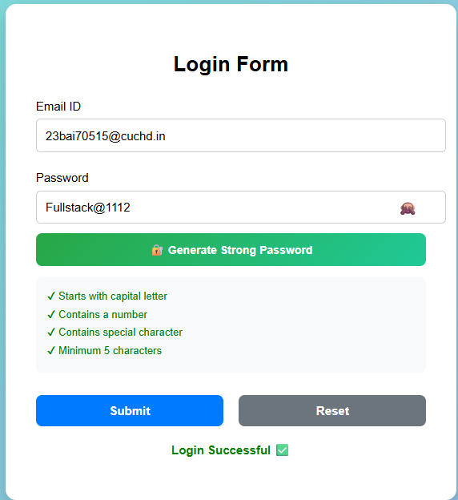

# React Form Validation Example

## 📌 Experiment Title
Form Validation and Event Handling in React

## 🎯 Aim
To implement **input validation and event handling** in a React form.

## 🧠 Description
This project demonstrates how to validate form inputs before submission. The form checks whether required fields are filled and ensures that the date of birth is not set in the future.

Alerts notify the user if any validation rule fails.
## ScreenShots

## 🛠 Technologies Used
- React
- JavaScript (ES6)
- CSS
- HTML

## ✨ Features
- Field validation for required inputs
- Alert messages for missing fields
- Validation for Date of Birth
- Reset button to clear the form
- Clean UI with styled form layout

## ⚙️ Validation Rules
The form checks for:

- Empty First Name
- Empty Last Name
- State selection
- At least one skill selected
- Gender selection
- Address field
- Date of birth entered
- Date of birth cannot be in the future

## 🔄 Additional Functionality
- **Submit Button** – validates and processes form data
- **Reset Button** – clears all form fields

## 📸 Output
The application shows a registration form with validation alerts if incorrect or incomplete data is entered.

## ✅ Result
The experiment successfully demonstrates how to implement form validation and event handling in React applications.