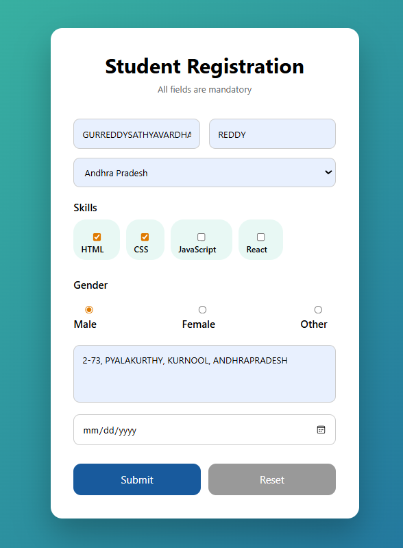
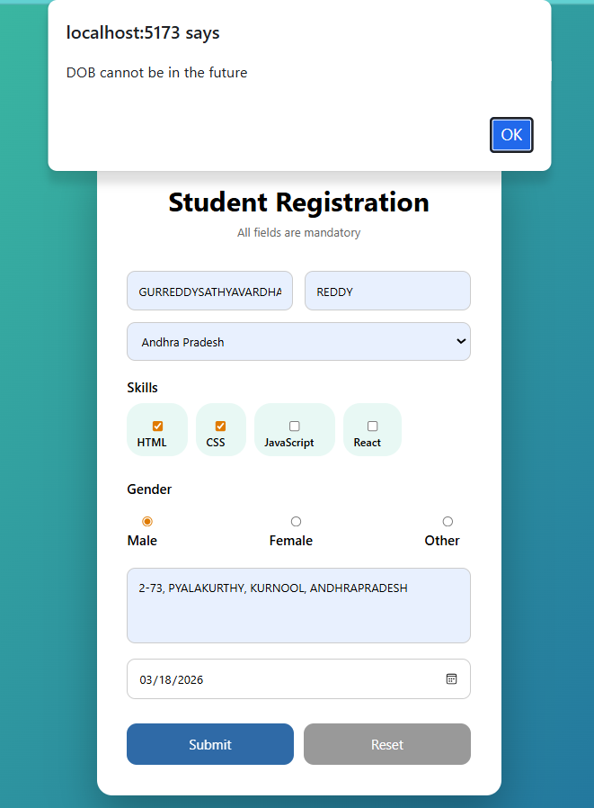
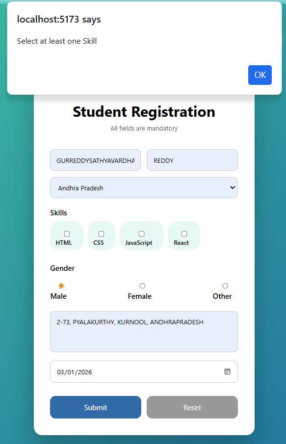
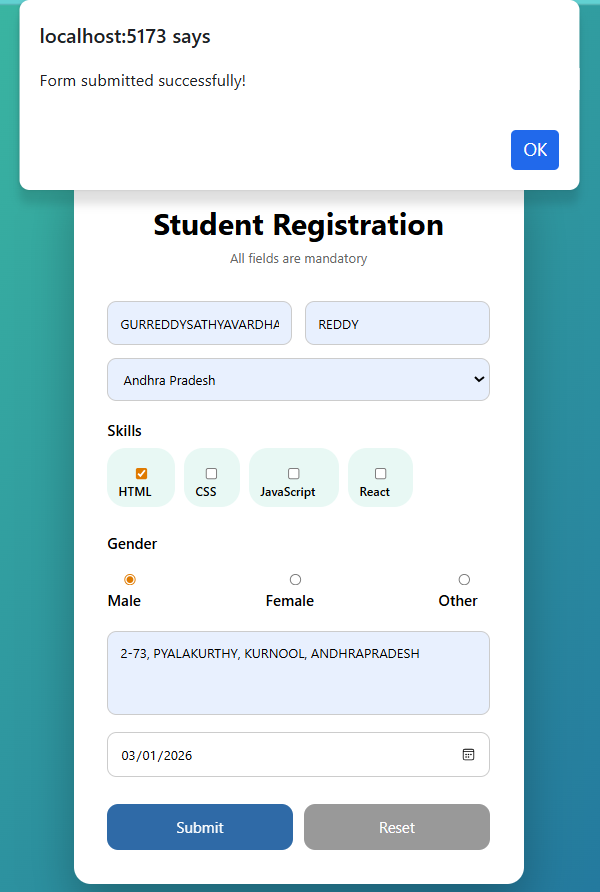

# React Controlled Form Example

## 📌 Experiment Title
Handling Forms Using Controlled Components in React

## 🎯 Aim
To create and manage form inputs using **controlled components** in React.

## 🧠 Description
This project demonstrates how to build a form in React where all input elements are controlled by React state using the `useState` hook.

Users can enter personal details such as name, state, skills, gender, address, and date of birth. The form captures the data and displays it through event handling.
## ScreenShots

## 🛠 Technologies Used
- React
- JavaScript (ES6)
- CSS
- HTML

## ✨ Features
- Controlled input fields using React state
- Dropdown selection
- Checkbox inputs for skills
- Radio buttons for gender
- Textarea for address
- Date picker for date of birth
- Clean and responsive UI

## 📂 Project Structure

src
├── App.jsx
├── App.css
├── main.jsx
└── index.css

## ⚙️ How It Works
1. React `useState` is used to store form values.
2. `handleChange()` updates state when inputs change.
3. Checkbox inputs update an array of selected skills.
4. Radio buttons manage gender selection.
5. Form data is processed when the user submits the form.

## 📸 Output
The application displays a **student registration form** where users can enter their details.

## ✅ Result
The form successfully demonstrates how controlled components manage and update input values in React applications.